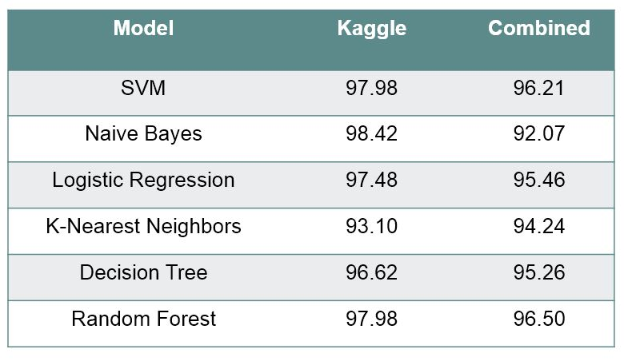
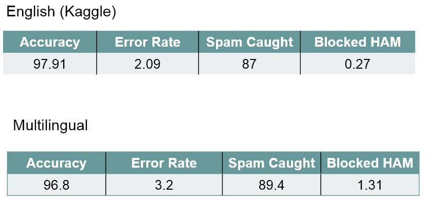

# Multilingual SMS spam detection using RNN

## Objective
> To develop an efficient translation-free recurrent neural architecture to  perform multilingual SMS spam detection which actually remembers the context of SMS.

This is based on the context of message rather than the contact numbers, from where SMS is arrived.

## Plan of Attack

1. Data Aquisition
2. Data Cleaning
3. Text Preprocessing
4. Machine Learning Algo's
5. Results

### 1. Data Aquisition

Collected dataset from (kaggle)[https://www.kaggle.com/uciml/sms-spam-collection-dataset], that contains only english messages.
We also added our own dataset, collected from real world messages that is of three languages English, Hindi, Telugu. We manually labelled the data into SPAM or HAM.

Dataset consists of three columns index, sms, label. label = { SPAM, HAM}

Total dataset contains around 10000 records. Its an unbalanced dataset, because we have 80% of them as HAM messages and remaining 20% SPAM messages.

```
2     spam  Free entry in 2 a wkly comp to win FA Cup fina...
3      ham  U dun say so early hor... U c already then say...
4555   ham  మీ జియో నంబర్ 8639417540 పై 1 GB హై స్పీడ్ ఇంట...
```

### 2. Data Cleaning

Basic Data cleaning steps performed, checking for missing values. As data consits only text, we do basic text cleaning like stopwords removal, punctuations removal, converting to lower words, stemming.

### 3. Text Preprocessing

We need to convert text data to numerical vectors to train any machine learning model. we used Bag of Words and later realized Sequence is important information and got to know about Word2Vec and implemented it.
In BoW, Each message is represented by its unique words frequency.
In Word2Vec, we consider weights from neural network layer, which we input the entire sequence.

We also do Padding, Padding gives every review vector of same dimension. We do prepadding here, means adding zeroes before the vector.

### 4. Machine Learning Models

Applied all these below mentioned models.

**1. Support vector Machines**

**2. Naive Bayes**

**3. Logistic Regression**

**4. K-Nearest Neighbors**

**5. Decision Tree**

**6. Random Forest**

Later realised, for sequence data using LSTMS (Long Short Term Memory) increases the prediction accuracy. So we implemeted **LSTM**


### 5. Results

here, Kaggle means Kaggle dataset(which contains only english sms's) and Combined ( mix of languages).

These are the accuracies when tried using BoW,

<p align="center">
  
</p>

Accuracy obtained using LSTM model.

<p align="center">
  
</p>


**You can follow the PPT presentation in the presentation folder (github)**
